<div align="center">

<!-- Typing animation banner -->


<br/>

<!-- Social badges -->
[](https://github.com/ahitshamkhan)
&nbsp;
[](https://github.com/ahitshamkhan)

</div>

---

## 🧑‍💻 About Me

```yaml
name:       Ahitsham Khan
username:   ahitshamkhan
location:   Pakistan 🇵🇰
degree:     BS Software Engineering
cgpa:       3.8+ / 4.0

focus:
  - Full-Stack Web Development (MERN Stack)
  - Artificial Intelligence & Machine Learning
  - Cloud Technologies & DevOps
  - Open Source Contributions

currently:
  - 🔨 Building scalable MERN stack applications
  - 🤖 Exploring AI tools & advanced models
  - 📚 Contributing to open source projects
  - 💡 Learning advanced system design

goal: "Build innovative solutions that impact millions globally"
```

---

## 🛠️ Tech Stack

<div align="center">

### 💻 Languages & Markup


### 🚀 Frameworks & Libraries


### 🗄️ Databases & Tools


</div>

---

## 📊 GitHub Metrics

<div align="center">

<!-- General stats + languages + calendar (generated by GitHub Actions) -->


<br/>

<!-- Achievements (left) + Habits (right) side by side -->

&nbsp;


<br/>

<!-- Topics & starred repos -->


</div>

---

## 🚀 Featured Projects

<div align="center">

[](https://github.com/ahitshamkhan/E-Commerce-MERN)
[](https://github.com/ahitshamkhan/AI-Chat-Bot)
[](https://github.com/ahitshamkhan/Portfolio-Website)
[](https://github.com/ahitshamkhan/Task-Manager)

</div>

---

## 📈 GitHub Statistics

<div align="center">


</div>

---

## 🌐 Connect With Me

<div align="center">

[](https://linkedin.com/in/ahitshamkhan)
[](https://twitter.com/ahitshamkhan)
[](https://github.com/ahitshamkhan)
[](https://ahitshamkhan.dev)

</div>

---

## 💼 Professional Summary

- 💻 Full-Stack Developer with expertise in MERN stack
- 🤖 Passionate about AI/ML and emerging technologies
- 🔧 DevOps enthusiast with Docker & Kubernetes experience
- 📖 Continuous learner and open source contributor
- 🎯 Problem solver focused on scalable solutions

---

<div align="center">
  <sub>⚡ Auto-updated daily via <a href="https://github.com/lowlighter/metrics">lowlighter/metrics</a> · Made with ❤️ from Pakistan 🇵🇰</sub>
</div>
